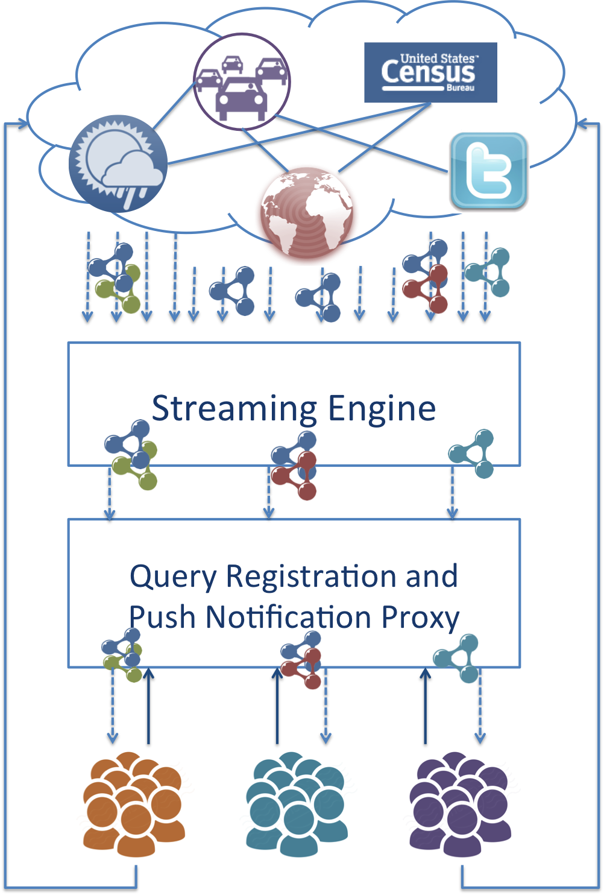
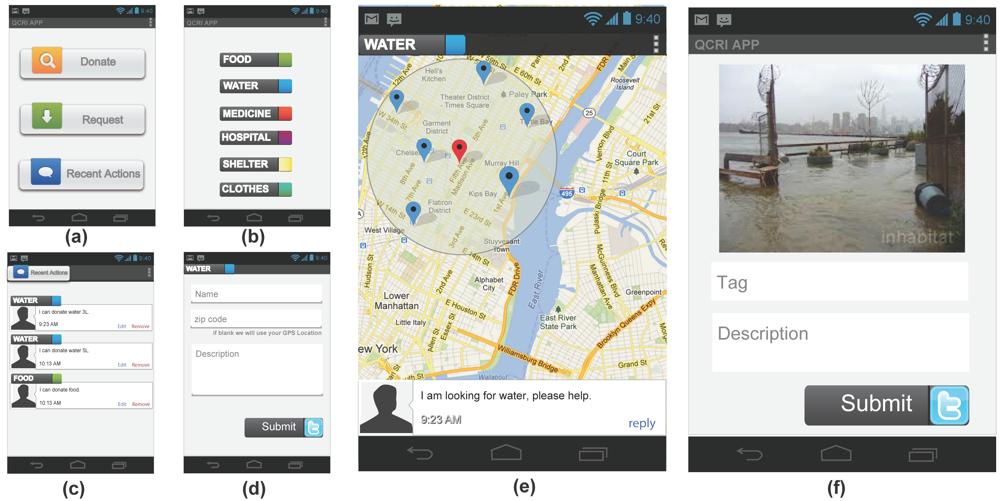
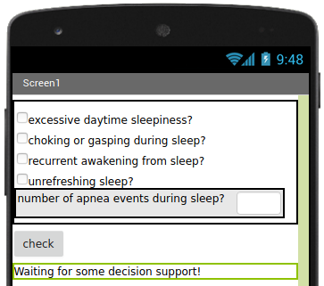
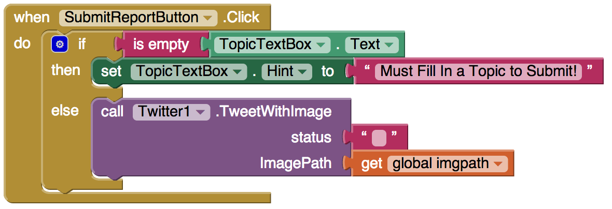
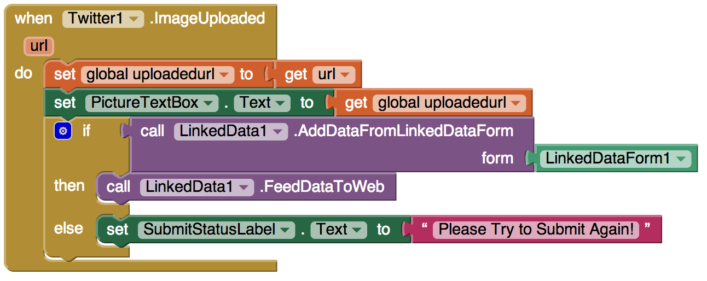

---
# Feel free to add content and custom Front Matter to this file.
# To modify the layout, see https://jekyllrb.com/docs/themes/#overriding-theme-defaults

layout: home
responsive: true
title: The Punya Project 
description: Punya is not your average app
---

<section id="overview" markdown="1">

# What is Punya?

Smartphones are quickly becoming the primary computing and communication platform for people’s daily tasks. With the rise of social networks, people are now comfortable with frequently updating their social profiles with their current activities and/or locations. This new source of information, social signals from microblog platforms, has been found to be especially useful in disaster management and relief operations. For example, during the recent Beijing flash floods, people took to Twitter to provide info rmation about the flooded areas and collaboratively developed a live crisis map of the floods impact using Google Maps. By integrating crowdsourced information with Geographic Information Systems (GIS) data or other open datasets released by the local government, some technical volunteers have developed useful mobile applications for disaster reliefs. However, each organization usually has its own application that creates or consumes data stored in standalone databases, or even worse, in spreadsheets. This means most of these applications are built in silos without exploiting the potential of being “interlinked” with other data collected from other organizations, or even the government. The lack of expertise and the cost for building mobile applications cause relief workers to turn to more manual steps for merging various reports from volunteers. Consequently, the increasingly unorganized and scattered information become noise in the system and can sometimes slowdown the decision making process.

One major challenge is how to effectively integrate data generated by multiple parties, including the “crowd”, relief organizations, and government agencies. We address this challenge by using Linked Data principles to enable the reuse, extension and integration of heterogeneous structured data from distributed sources. However, consuming and generating Linked Data is difficult especially on mobile devices. In this project, we are also focussing on reducing the barrier to the adoption of Linked Data technologies on smartphones.

Punya cloud architecture
{:.caption}

Our vision is to build up an ecosystem of multi-language and multi-modal tools and volunteer developers around mobile technologies. We envision volunteers working with relief organizations to collaboratively customize, develop, or use mobile apps during a particular crisis to perform a variety of tasks – such as data collection, notification of aggregate information to key decision makers, and co-ordination of relief efforts. The use of mobile technologies will greatly speed up these relief operations that currently suffer from lack of technology or insufficient human resources. The Punya project is aimed at enabling this ecosystem to exist by addressing the key mobile requirements of the humanitarian sector and opening it out to mobile volunteers  by reducing the barrier to using these technologies.

</section>

<section id="use-cases" markdown="1">

### Use Cases

####  Mobile App Development for Disaster Management

This app is inspired by [MatchApp](https://irevolutions.org/2013/02/27/matchapp-disaster-response-app/), where requests for resources are met with the availability of those resources. Consider this resource match-making scenario: Alice lives in New York City. After Hurricane Sandy hits, Alice wants to help people in need. Bob has been affected by the crisis. Both Bob, the requestor, and Alice, the donator, can place the donation and request for items within our app as shown in the figure below. They can also view/edit/remove recent list of their activities as shown in (c). Alice chooses to donate water, so she checks up all the people within a 3 miles radius of her location who are in need of water on a map as shown in (e). Bob had previously requested water by using our app (d). Alice selects Bob from the list of people in need. Alice and Bob can message directly with each other to arrange the exchange.

On his way to the grocery store, after a severe hurricane, Joe noticed many parts around his community are in bad conditions. For example, fallen trees are blocking the road and some can be dangerous for the pedestrians. With our WeReport app, he could take either a picture or a video of the scene. He decides to take a picture of the road, by adding a "tag" and a "description" to the image as shown in (f) in the figure above.

{:#img-usecase.max-width}

*WeReport User Interface*

####  Experience Sampling Methods using Mobile Sensors

Shih captured contextual data about everyday mobile use with components of Punya and prompted smartphone users about their privacy preferences under different circumstances.[^1] Shih used a number of different "probes" to collect information about what the user was doing, including location information, what apps were running on the device and when, etc. The `Survey` component was utilized to ask the users questions about their perceived privacy. The `GoogleCloudMessaging` component was used for scheduling push notifications to the device to initiate user surveys. Other researchers can similarly leverage these components to employ experience sampling methodology in their research apps.

####  Patient Diary for Sleep Apnea

Mobile patient diaries are apps used by chronic patients to record medications, symptoms, and vitals---they provide a convenient way for patients to keep track of their health data, and, when they are integrated into Electronic Health Records (EHR), communicate health data to clinicians for longitudinal follow-up. Clinical decision support (CDS) tools, added to the EHR system, can issue recommendations to help with diagnosis and treatment.

In many cases, however, it would be opportune for a patient diary to directly provide decision support: for urgent patient health issues, when wireless connectivity is lacking, or when secure integration with an EHR system is non-existent. Sleep Apnea, for example, has an estimated prevalence from 3% to nearly 50% depending on age group and sex[^2], with a gold-standard diagnosis involving polysomnography[^3], a comprehensive test which involves monitoring heart, lung, and brain activity, breathing patterns, and blood oxygen levels. However, more simple home sleep apnea testing may be used to indicate the diagnosis in symptomatic patients[^2]. An app, running locally on the user's device and outfitted with mobile decision support, can directly analyze the user's health, based on user input and sensor data, and issue a potential diagnosis of sleep apnea[^4].

In general, researchers can leverage the `Ruleset` blocks, `LinkedData` and `Reasoner` components, to implement mobile decision support on smartphones. A [dedicated tutorial](http://punya.appinventor.mit.edu/?repo=SleepApnea) provides step-by-step directions on how to implement a sleep-apnea mobile app.

####  Diabetes Management App

We developed this application as an exemplary prototype mobile app for diabetic patients to manage their diet, exercise, and medication input. Patients can enter their meals and exercises that will be semantically annotated. Upon submitting the form, a knowledge graph will be created automatically with the help of the `LinkedDataForm`. The `SemanticListPicker` is utilized to query external ontologies such as the [FoodOn](https://foodon.org) to retrieve the type and other ontological information pertaining to the food that's entered. The `Ruleset` blocks are utilized to define and execute rules that can be used to ascertain if a particular food is suitable for the user's consumption.

Project File: [diabetes.aia](resources/diabetes.aia)

Demo: 

<iframe width="560" height="315" src="https://www.youtube-nocookie.com/embed/fFv-sPmd_G4" title="YouTube video player" frameborder="0" allow="accelerometer; autoplay; clipboard-write; encrypted-media; gyroscope; picture-in-picture" allowfullscreen></iframe>

####  Punya in the Semantic Web of Things: LDP-CoAP

The _Semantic Web of Things_ (SWoT) vision integrates knowledge representation and reasoning techniques from the Semantic Web into Internet of Things architectures providing more advanced service/resource management and discovery. SWoT enables new classes of smart applications that augment real-world objects, locations, and events with machine-understandable data, annotated with a domain ontology, using mobile and pervasive devices such as smartphones, wearables, and IoT sensors.
Currently, Punya supports _LDP-CoAP_ [^5], a SWoT protocol that enables lightweight, LD-based resource dissemination and discovery in dynamic ad-hoc contexts.

An example of mobile phone sensor sharing app is proposed exploiting the `LdpCoapClient` component for Punya. 
The app works as a client of an external CoAP server, publishing sensors and sensor data as [Linked Data Platform](https://www.w3.org/TR/ldp/) resources, to discover resources published by other applications.
A [dedicated tutorial](http://punya.appinventor.mit.edu/?repo=LdpCoapTutorial) provides step-by-step directions on how to implement a sensor sharing app for the Semantic Web of Things.

####  Collection of Semantic Sensor Network data

Kinkead _et al._[^6] proposed a mobile application for recording semantic metadata about sensor network deployments and experimental settings in real time in order to enable a more efficient and less error-prone data collection.
In particular, the app uses the device camera to identify a sensor using their QRcode, and GPS to automatically identify the sensor location.
Gathered dara are used to study water and ecosystem quality around Lake George (NY, USA).
The quick prototyping of such research apps, by non-IT professionals (in this case, ecologists), requires an end-user development platform with a minimal learning curve. Using Punya, the ecologists were able to develop the app in a matter of weeks; moreover, the researchers believed that the platform could be similarly utilized also to rapidly prototype observation-based mobile apps in other fields.

</section>

<section id="platform" markdown="1">

### App Building Platform <small>Program with drag-and-drop</small>

Punya is built on top of the [MIT App Inventor](http://appinventor.mit.edu/explore/) block programming system, which allows non-programmers to quickly create mobile applications for the Android operating system (OS). It uses a graphical interface that allows users to drag-and-drop visual objects to create an application that can run on Android devices.  Punya adds advanced capabilities to App Inventor including Linked Data capability, sensors, offline-tolerance, and cloud services. Leveraging Linked Data enables developers to reuse the thousands of useful datasets out there in the Linked Open Data cloud and allows the data generated to be easily integrated with data from other apps. Furthermore, Punya also provides easy access to sensors and other personal information on the smartphone. By moving a few blocks and putting them together, you can build a crowdsourcing app that reports live events happening in your community. Another possible app is one that alerts its users when more than thousands of [people are tweeting an nearby and upcoming snowstorm](http://www.ajc.com/news/news/in-snow-storm-its-social-media-to-the-rescue/nc6Kc/).

{:style="max-width: 70%;"}

*Submits photos from your smartphone to TwitPic*

{:style="max-width: 70%;"}

*Submits Linked Data from your smartphone*

</section>

### Linked Data Cloud Services

<section id="services" markdown="1">

<i class="icon-screenshot"></i> The **push notification** service is good at cutting through the noise and delivering the useful information to the hands of the people that want it. For example, field workers who use a disaster relief app might want to be notifid when the specific kinds of resources has arrived. Local volunteers who use MatchApp want to know when some people are in need that they can offer help. With push notification, an app can always delievers messages to people directly to update the most recent situation. Punya makes it easy for apps to use LD-based push notification to send up-to-dates information.

<i class="icon-map-marker"></i> The **sensor components** provides many high-level components for access to smartphone sensors and personal information.  For example, it has components for reading the GPS location, taking photos with the camera, receiving SMS texts, and sending Twitter messages. All the built-in functions are just a "block" away. 

</section>

<section id="quickstart" markdown="1">

# Quick Start Guide

To try Punya, log into our [Punya instance](http://punya.appinventor.mit.edu/) with a Google account. Then import the applications below.

1. An app that queries dbpedia and generates a list [[Download Project](/tutorials/1/BasicQuery.aia)]
2. An app that queries dbpedia and displays it on a map [[Download Project](/tutorials/2/DisplayMap.aia)]

### Creating Punya Apps

In these videos, we will show you how to create and use our featured app, WeReport. WeReport is an crowdsource app that allows its users to voluntarily generate short reports about what's happening nearby. The report can contain a photo taken by the user and a short description describing what is going on. On the other hand, a user can also subscribe to the topics of events that they are interested. Whenever an event was reported by the crowd, those who subscribe to a specific topic that matched the event will receive an alert through push notificaitons according to their current location. For example, if a voluntary relief worker wants to know when there are power outage reported in the community and offer helps just in time.

Furthermore, you will also learn how to modify WeReport app to meet your needs. Maybe you want to build a traffic accident report app, or maybe you want to build an app that reports live events happening in a country fair! With a few changes in the blocks, you can have your own app!

<iframe width="560" height="315" src="https://www.youtube.com/embed/3gGJurMHasg" title="YouTube video player" frameborder="0" allow="accelerometer; autoplay; clipboard-write; encrypted-media; gyroscope; picture-in-picture" allowfullscreen></iframe>

<iframe width="560" height="315" src="https://www.youtube.com/embed/SQkX56FVRHY" title="YouTube video player" frameborder="0" allow="accelerometer; autoplay; clipboard-write; encrypted-media; gyroscope; picture-in-picture" allowfullscreen></iframe>

</section>

# References & Footnotes

[^1]: Shih, F. [ContextProbe: Exploring mobile privacy in context](https://dspace.mit.edu/handle/1721.1/97811). Ph.D. Thesis, MIT (2015)
[^2]: Laratta, C.R., Ayas, N.T., Povitz, M., Pendharkar, S.R.: Diagnosis and treatmentof obstructive sleep apnea in adults. CMAJ189(48), E1481–E1488 (2017)
[^3]: Mayo  Clinic:  Polysomnography  (sleep  study),https://www.mayoclinic.org/tests-procedures/polysomnography/about/pac-20394877
[^4]: Roy, P.C., Al Haider, N., Van Woensel, W., Ahmad, A.M., Abidi, S.S.R. Towards Guideline Compliant Clinical Decision Support System Integration in Smart and Mobile Environments: Formalizing and Using Clinical Guidelines For Diagnosing Sleep Apnea. AAAI Workshop on Artificial Intelligence Applied to Assistive Technologies and Smart Environments (ATSE 2014), AAAI Press, Quebec, Canada, 2014.
[^5]: Loseto, G., Ieva, S., Gramegna, F., Ruta, M., Scioscia, F., Di Sciascio, E.: [Linked Data (in low-resource) Platforms: a mapping for Constrained Application Protocol](https://link.springer.com/chapter/10.1007/978-3-319-46547-0_14), The Semantic Web - ISWC 2016: 15th International Semantic Web Conference, Volume 9982, pp. 131-139 (2016).
[^6]: Kinkead, L., Pinheiro, P., McGuinness, D.L.: [Automating the collection of semantic sensor network metadata in the field with mobile applications](http://ceur-ws.org/Vol-1506/paper4.pdf). In: Proc. 1st Int. Workshop on Mobile Deployment of Semantic Technol. pp. 32–43 (2015)
